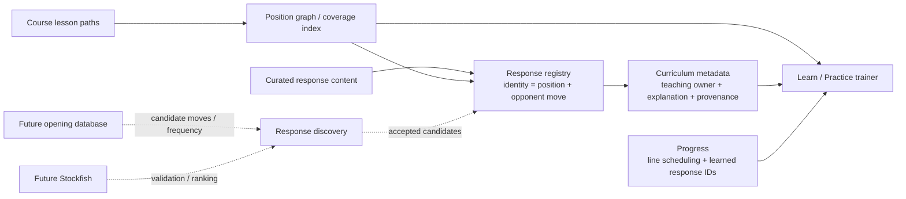
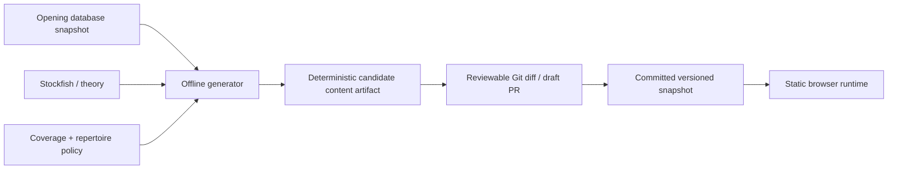

# ChessReps / OpenRep Engineering Instructions

These instructions apply to all code changes in this repository.

## 1. Scope every change before implementation

Before editing code, do a short three-part scope review.

### Product scoping
Cover:
- intended user-visible behavior;
- UX and interaction details;
- important edge cases;
- explicit non-goals.

### Architecture / engineering scoping
Cover:
- domain model and data flow;
- component/module boundaries;
- opportunities for reuse rather than duplication;
- test impact;
- likely tech-debt risks.

Prefer architectural/domain-level fixes over one-off cases, hard-coded move exceptions, or copy-only patches when the underlying problem is structural.

### Future evolution / migration scoping
Before implementation, proactively identify likely next-stage data sources, product capabilities, or replacements for the code being changed. Explicitly assess whether the proposed design would make those known directions harder to adopt later.

In particular:
- do not wait for the user to ask whether a future refactor will become harder;
- keep stable domain identity independent from the current data source, UI placement, curriculum ownership, or authoring convenience;
- model provenance, ownership, discovery source, and presentation as metadata when they are not part of identity;
- prefer seams where a future automated source can feed the same domain model used by today's curated/static source;
- when the conversation establishes a likely future direction, treat it as standing architectural context for subsequent work;
- if a proposed implementation creates avoidable migration cost for a likely future direction, adjust the design before coding and call out the tradeoff.

## 2. Branch and PR policy

- Never make feature/fix work directly on `main`.
- Use a branch name that describes the actual change, for example `fix/repertoire-branch-feedback` or `feat/evaluation-bar`.
- Do not use generic names such as `features`, `features-v2`, `work`, `changes`, or similar continuation names.
- Reuse the current branch when continuing the same logical feature/fix.
- Keep the project in a single ongoing PR/workstream when practical; split work only when a separate PR is genuinely warranted.
- As soon as a new working branch is created/published, open a draft PR to `main`, or reuse the existing matching draft PR. Do not leave active branch work without its draft PR.
- Keep that PR as a draft until the user explicitly asks otherwise.
- Never merge to `main` without explicit user authorization.

## 3. Implementation policy

- Solve the general problem represented by the request, not only the example that exposed it.
- Keep product semantics in domain/application code rather than encoding them as UI copy conditions.
- Prefer typed/classified states and explicit interfaces over inferring behavior late in rendering.
- Preserve existing abstractions unless there is a concrete reason to replace them.
- Avoid introducing duplicate sources of truth.
- Define canonical domain identity explicitly when equivalent states can be reached through multiple paths.
- Do not use labels, lesson IDs, authoring anchors, or source-specific IDs as identity when the underlying domain object has a more stable key.
- Validate domain uniqueness/invariants at construction boundaries so bad course data fails fast instead of producing duplicate or contradictory UI later.

### Learner-facing move notation invariant

Learner-facing explanatory prose should show chess moves without Black-move ellipses or embedded move-number prefixes. For example, render `c5` and `Bf5`, not `...c5`, `3...c5`, or `4...Bf5`.

- Authored/static/generated source content may retain conventional notation when useful for provenance or authoring; normalize it at the shared teaching/presentation boundary.
- Apply the convention consistently across prompts, feedback, branch briefings, curriculum titles/plans/recognition copy, response labels, evidence/tooltips, and future explanatory surfaces.
- Do not solve this by editing one occurrence of copy when the same notation can enter through other content sources.
- Explicit move-sequence notation whose purpose is to show numbered game history is a separate presentation concern and may retain move numbers when intentionally designed as notation rather than prose.

### Teaching-unit presentation invariant

A stable response is one teaching unit regardless of how the learner navigates to it. Navigation and route execution must not create alternate learner-facing identities for the same `responseId`.

- `responseId` identifies the response teaching unit. `sessionRoute`, `teachingOwnerLineId`, divergence ply, authoring anchor, and the line used to reconstruct the position are execution/authoring mechanics, not lesson identity.
- If a response belongs to a primary curriculum family, resolve its learner-facing title, tier, and role through the shared curriculum teaching-unit presentation resolver. Curriculum-map entry, opponent-alternative entry, completed-line response entry, and transposed entry must produce the same title and metadata.
- A primary family with no full lines and exactly one response is a standalone response family. Its family title is the lesson title; do not render a second conceptual child title that makes the same material look like a different lesson. A child action may show the concrete `<opponent move> → <repertoire response>` pair.
- A response teaching unit owns one opponent decision and one repertoire answer. Optional continuation is illustrative context; it must not silently become additional required repertoire-side decisions.
- If the teaching objective requires the learner to make multiple later repertoire-side decisions, model that material as a full line/branch. Full-line coverage then takes precedence over a standalone response for the same opponent move.
- A response inside a mixed family may retain its response-specific child title, but family/tier metadata still comes from the same canonical resolver.
- Do not expose route-owner copy such as `Another good move` or `from <teaching owner line>` as the canonical lesson header when curriculum metadata already owns that teaching unit.
- Regression coverage should verify presentation parity across at least two entry paths for a curriculum-mapped response when practical, and must reject route-owner copy leakage in the canonical header.

### Learn / Practice parity invariant

Learn and Practice should share trainer behavior and UI by default. Differences between the modes are a frequent source of regressions and must be kept deliberately small.

- Implement new teaching, feedback, move-acceptance, completion, board, and explanation behavior through shared code paths unless a mode-specific pedagogical requirement makes that impossible.
- Restrict ordinary mode differences to material selection, discovery/progress state, scheduling/grading, and other explicitly mode-owned workflow mechanics.
- Do not create lighter, denser, differently worded, or otherwise divergent Learn/Practice presentations merely because the mode names differ.
- Any new `mode === 'learn'` or `mode === 'practice'` behavior branch that changes the learning interaction must have a concrete product justification and parity/regression coverage where practical.
- When fixing a trainer behavior bug, verify the shared behavior in both Learn and Practice unless the behavior is inherently specific to one mode.

### History navigation projection invariant

History navigation changes the viewed chess position without changing the underlying lesson/session state. Treat rewind/forward as a projection of the session at `displayPly`, not as either a full application refresh or a frozen copy of the current-position UI.

- Every position-dependent surface must project from the position currently shown on the board. This includes advice, move feedback/explanations, opponent alternatives, response/completion teaching visibility, evaluation, and future position-context UI.
- Teaching surfaces that describe one repertoire decision must share one explicit decision-context object. Advice and opponent alternatives must never independently infer their own ply/turn context.
- A decision context advances when the opponent move establishes the next repertoire decision and remains fixed through the repertoire reply. Therefore advice and “Other good moves” change together on the opponent move and stay together across the repertoire move.
- A feedback panel may preserve the live training result internally while history is open, but the visible historical feedback must describe the most recent repertoire-side move applicable at the viewed position. Returning to the current position restores the live result.
- Session-owned state must not be rewritten by history navigation. Progress, grading state, scheduling, selected lesson/route, mistakes, and learned-response state remain unchanged while their position-dependent presentation may be hidden or projected.
- History navigation must use an explicit projection path rather than the full trainer `refresh()`. New position-context UI must opt into that projection path.
- Regression coverage must verify multiple right-panel surfaces at multiple plies, including a case where historical move feedback changes from one repertoire move to an earlier one and a case where all decision-context teaching surfaces cross the same ply boundary atomically.

### Position-equivalent attempt invariant

A move attempt is a function of the displayed chess/decision state, not of the navigation path used to reach that state. If the user reaches the same repertoire decision position and tries the same move, the teaching result must be identical.

- `1 → 2 → X` and `1 → 2 → 3 → 2 → X` must produce the same move classification, score difference, explanation language, repertoire-match language, and teaching arrow for `X`.
- Live and historical attempts must execute the same classification/evaluation/feedback pipeline against an explicit position context. Do not maintain a simplified history-only wrong-move copy path.
- The permitted difference is session mutation: a historical attempt may suppress progress, scheduling, grading, completion, and mistake-count mutations while preserving the exact learner-facing result.
- Engine evaluation must evaluate the displayed position and attempted move, not the current live position hidden behind history navigation.
- Any future move-feedback surface added to the live attempt pipeline must automatically apply to equivalent historical attempts; requiring a separate history implementation is an architectural regression.
- Regression coverage must compare equivalent live and rewound attempts and assert learner-facing parity as well as non-mutation of session-owned state.

## 4. Architecture invariants

Read `ARCHITECTURE.md` before changing repertoire discovery, curriculum modeling, position/response identity, generated content, personalization, or opening-data ingestion. Its diagrams are the expanded reference architecture.

OpenRep should keep chess-state identity, repertoire coverage, response discovery, curriculum ownership, curriculum presentation, and learner progress as separate concerns. The current response architecture should evolve along this seam:

### Content-generation boundary

Opening-database exploration and broad engine analysis belong at offline/content-generation time, not in the browser runtime.

- A routine production build must consume committed content; it must not silently query live opening databases or regenerate the curriculum.
- Scheduled/manual refreshes may generate candidate changes, but material curriculum/repertoire changes should be reviewed through Git/PRs.
- Generator output should be deterministic for a fixed database snapshot, cohort, engine version/settings, generation-policy version, and curated overrides.
- The runtime coverage index answers what the shipped repertoire contains. It should not become the system that decides what repertoire ought to exist.
- Future personalized frequency/tier views should normally re-rank accepted stable content rather than mutate position/response identity in the browser.

### Curriculum model boundary

- Generic curriculum mechanics belong in opening-agnostic modules. Opening-specific files should contain data/evidence, not copied validator/builder/trainer logic.
- A line has one primary curriculum family for deterministic course-map placement. A directly surfaced response may also have at most one primary family.
- Pedagogical concepts/tags are many-to-many and separate from primary families. Do not use the course hierarchy as the ontology for pawn structures, motifs, transpositions, recognition cues, or other cross-cutting teaching concepts.
- Curriculum tier, family, evidence, ordering, labels, cohort, and presentation are metadata, not line/position/response identity.
- Future opening generators should emit the same generic curriculum schema consumed by curated opening data today.

Key identity invariants:
- chess position identity is based on normalized position state, not move-order history;
- a response is canonically identified by `(position, opponent move)`;
- `responseId` is the stable progress/content handle for that canonical response;
- a response has exactly one teaching owner, but may apply from multiple lessons/transpositions;
- an authoring anchor is only a convenient way to reconstruct a position in static course data; it is not identity or ownership;
- curated content and future opening-database/engine discovery should feed the same response registry rather than creating parallel training systems;
- full repertoire branches take precedence over standalone response content for the same `(position, opponent move)`.

## 5. Testing and CI policy

For every behavior change:
- add or update focused unit tests for the underlying domain behavior;
- add/update integration or E2E coverage when the user-visible behavior changes;
- include regression coverage for the specific reported bug when practical;
- test architectural edge cases such as transpositions/equivalent states when relevant, not just the exact reported sequence;
- test construction-time invariants when the change introduces canonical identity, ownership, or deduplication rules.

After every pushed change:
- inspect the PR CI run rather than assuming it passed;
- follow the run through completion;
- if a check fails, inspect the failing job and logs, identify the root cause, fix it, and push again;
- do not treat a skipped deployment as a deployment;
- do not report a change as verified until the relevant checks actually pass.

If CI or local verification cannot be inspected, state the exact limitation.

## 6. Deployment policy

The user grants standing authorization to deploy non-main branches for this repository.

The draft PR is the canonical preview/deployment path. After every code change:
- push/update the current non-main branch and its draft PR;
- allow the PR CI workflow to test and deploy that branch;
- inspect the deployment job through completion;
- verify the deployed preview/result when tooling permits;
- report the deployed branch/preview and any deployment failure clearly.

Do not say a branch is deployed merely because a deployment workflow was triggered. A failed or skipped deploy is not deployed.

Deployment authorization does **not** imply authorization to merge to `main`.

## 7. Completion checklist

Before reporting a change complete, confirm:
1. product scope reviewed;
2. architecture/engineering scope reviewed;
3. future evolution/migration impact reviewed;
4. branch name describes the actual feature/fix;
5. a matching draft PR exists;
6. implementation addresses the general case;
7. relevant tests were added/updated;
8. PR CI was inspected through completion and is green;
9. the deployment job completed successfully, or an exact blocker was reported;
10. `main` was not merged without explicit authorization.
