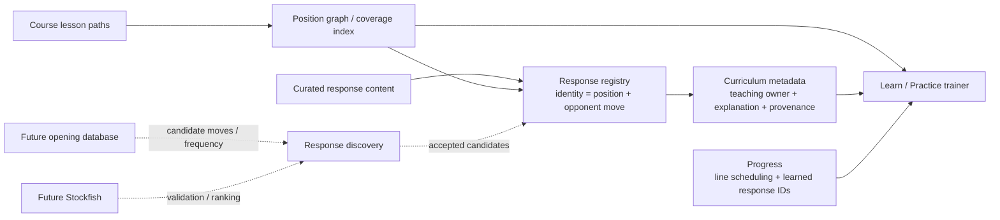

# ChessReps / OpenRep Engineering Instructions

These instructions apply to all code changes in this repository.

## 1. Scope every change before implementation

Before editing code, do a short three-part scope review.

### Product scoping
Cover:
- intended user-visible behavior;
- UX and interaction details;
- important edge cases;
- explicit non-goals.

### Architecture / engineering scoping
Cover:
- domain model and data flow;
- component/module boundaries;
- opportunities for reuse rather than duplication;
- test impact;
- likely tech-debt risks.

Prefer architectural/domain-level fixes over one-off cases, hard-coded move exceptions, or copy-only patches when the underlying problem is structural.

### Future evolution / migration scoping
Before implementation, proactively identify likely next-stage data sources, product capabilities, or replacements for the code being changed. Explicitly assess whether the proposed design would make those known directions harder to adopt later.

In particular:
- do not wait for the user to ask whether a future refactor will become harder;
- keep stable domain identity independent from the current data source, UI placement, curriculum ownership, or authoring convenience;
- model provenance, ownership, discovery source, and presentation as metadata when they are not part of identity;
- prefer seams where a future automated source can feed the same domain model used by today's curated/static source;
- when the conversation establishes a likely future direction, treat it as standing architectural context for subsequent work;
- if a proposed implementation creates avoidable migration cost for a likely future direction, adjust the design before coding and call out the tradeoff.

## 2. Branch and PR policy

- Never make feature/fix work directly on `main`.
- Use a branch name that describes the actual change, for example `fix/repertoire-branch-feedback` or `feat/evaluation-bar`.
- Do not use generic names such as `features`, `features-v2`, `work`, `changes`, or similar continuation names.
- Reuse the current branch when continuing the same logical feature/fix.
- Keep the project in a single ongoing PR/workstream when practical; split work only when a separate PR is genuinely warranted.
- As soon as a new working branch is created/published, open a draft PR to `main`, or reuse the existing matching draft PR. Do not leave active branch work without its draft PR.
- Keep that PR as a draft until the user explicitly asks otherwise.
- Never merge to `main` without explicit user authorization.

## 3. Implementation policy

- Solve the general problem represented by the request, not only the example that exposed it.
- Keep product semantics in domain/application code rather than encoding them as UI copy conditions.
- Prefer typed/classified states and explicit interfaces over inferring behavior late in rendering.
- Preserve existing abstractions unless there is a concrete reason to replace them.
- Avoid introducing duplicate sources of truth.
- Define canonical domain identity explicitly when equivalent states can be reached through multiple paths.
- Do not use labels, lesson IDs, authoring anchors, or source-specific IDs as identity when the underlying domain object has a more stable key.
- Validate domain uniqueness/invariants at construction boundaries so bad course data fails fast instead of producing duplicate or contradictory UI later.

### Learn / Practice parity invariant

Learn and Practice should share trainer behavior and UI by default. Differences between the modes are a frequent source of regressions and must be kept deliberately small.

- Implement new teaching, feedback, move-acceptance, completion, board, and explanation behavior through shared code paths unless a mode-specific pedagogical requirement makes that impossible.
- Restrict ordinary mode differences to material selection, discovery/progress state, scheduling/grading, and other explicitly mode-owned workflow mechanics.
- Do not create lighter, denser, differently worded, or otherwise divergent Learn/Practice presentations merely because the mode names differ.
- Any new `mode === 'learn'` or `mode === 'practice'` behavior branch that changes the learning interaction must have a concrete product justification and parity/regression coverage where practical.
- When fixing a trainer behavior bug, verify the shared behavior in both Learn and Practice unless the behavior is inherently specific to one mode.

## 4. Architecture invariants

OpenRep should keep chess-state identity, repertoire coverage, response discovery, curriculum ownership, and learner progress as separate concerns. The current response architecture should evolve along this seam:

Key invariants:
- chess position identity is based on normalized position state, not move-order history;
- a response is canonically identified by `(position, opponent move)`;
- `responseId` is the stable progress/content handle for that canonical response;
- a response has exactly one teaching owner, but may apply from multiple lessons/transpositions;
- an authoring anchor is only a convenient way to reconstruct a position in static course data; it is not identity or ownership;
- curated content and future opening-database/engine discovery should feed the same response registry rather than creating parallel training systems;
- full repertoire branches take precedence over standalone response content for the same `(position, opponent move)`.

## 5. Testing and CI policy

For every behavior change:
- add or update focused unit tests for the underlying domain behavior;
- add/update integration or E2E coverage when the user-visible behavior changes;
- include regression coverage for the specific reported bug when practical;
- test architectural edge cases such as transpositions/equivalent states when relevant, not just the exact reported sequence;
- test construction-time invariants when the change introduces canonical identity, ownership, or deduplication rules.

After every pushed change:
- inspect the PR CI run rather than assuming it passed;
- follow the run through completion;
- if a check fails, inspect the failing job and logs, identify the root cause, fix it, and push again;
- do not treat a skipped deployment as a deployment;
- do not report a change as verified until the relevant checks actually pass.

If CI or local verification cannot be inspected, state the exact limitation.

## 6. Deployment policy

The user grants standing authorization to deploy non-main branches for this repository.

The draft PR is the canonical preview/deployment path. After every code change:
- push/update the current non-main branch and its draft PR;
- allow the PR CI workflow to test and deploy that branch;
- inspect the deployment job through completion;
- verify the deployed preview/result when tooling permits;
- report the deployed branch/preview and any deployment failure clearly.

Do not say a branch is deployed merely because a deployment workflow was triggered. A failed or skipped deploy is not deployed.

Deployment authorization does **not** imply authorization to merge to `main`.

## 7. Completion checklist

Before reporting a change complete, confirm:
1. product scope reviewed;
2. architecture/engineering scope reviewed;
3. future evolution/migration impact reviewed;
4. branch name describes the actual feature/fix;
5. a matching draft PR exists;
6. implementation addresses the general case;
7. relevant tests were added/updated;
8. PR CI was inspected through completion and is green;
9. the deployment job completed successfully, or an exact blocker was reported;
10. `main` was not merged without explicit authorization.
