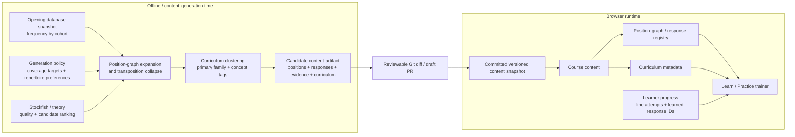
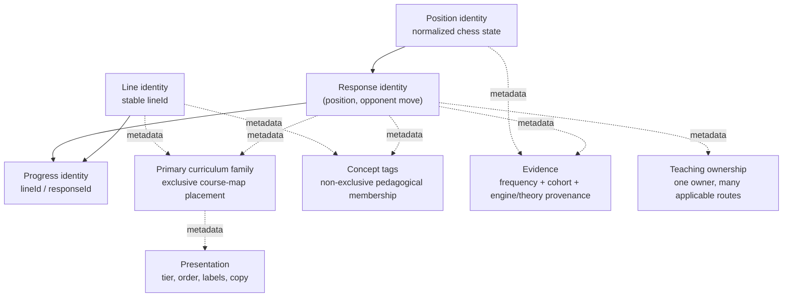
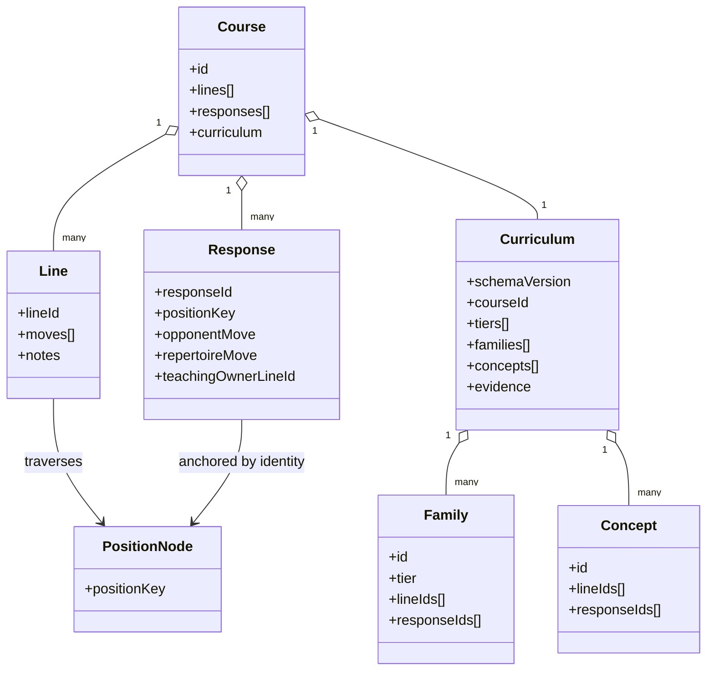
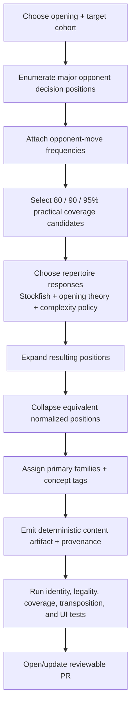
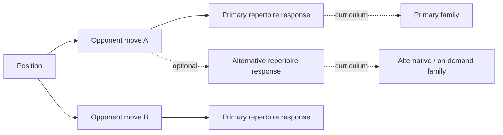
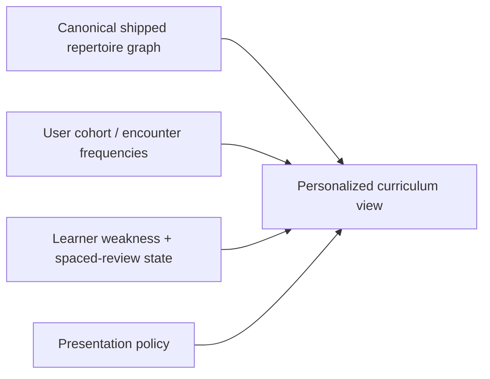
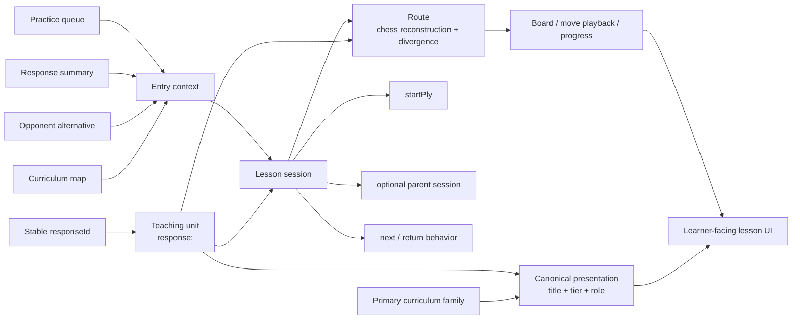
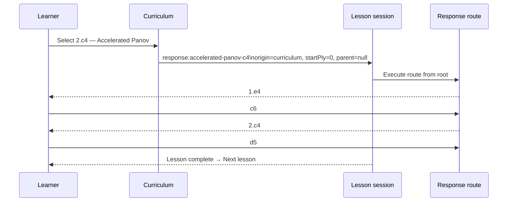

# OpenRep Architecture

This document records the intended domain boundaries and future evolution of OpenRep. `AGENTS.md` contains the standing implementation rules; this file expands the architecture diagrams those rules refer to.

## 1. Two separate systems: content generation and runtime training

OpenRep should treat repertoire discovery as an offline/content-generation concern and training as a deterministic runtime concern.

### Boundary rule

The browser runtime must not decide what repertoire ought to exist. It consumes accepted, versioned content. Opening-database queries, broad engine searches, coverage optimization, and automatic clustering belong before the Git snapshot boundary.

A routine production build should not silently regenerate curriculum from live external data. A scheduled/manual generator may refresh evidence and propose changes, but material changes should arrive as a reviewable PR.

## 2. Stable identity versus metadata

Identity must not depend on database source, engine version, curriculum tier, family, teaching owner, authoring anchor, or UI placement.

### Primary families versus concepts

A line belongs to exactly one primary curriculum family so the course map has a deterministic home for it. A response may also have at most one primary family when surfaced directly in the curriculum.

Concept tags are deliberately many-to-many. A line can simultaneously be an Exchange structure, a transposition-recognition example, and a move-order lesson. Do not overload primary families to represent every pedagogical relationship.

## 3. Runtime domain model

`PositionNode` is the conceptual long-term graph primitive. Today many runtime positions are reconstructed from authored line paths; future generated content may materialize position nodes directly. The runtime index should remain a coverage/query layer over shipped content, not become the discovery engine.

## 4. Content-generation lifecycle

A future generator should follow this lifecycle:

The generator should be deterministic for the same:
- external data snapshot;
- cohort definition;
- engine version/settings;
- generation-policy version;
- curated overrides.

Generated output should record those inputs as provenance. Do not commit an entire external opening database when a compact evidence snapshot is sufficient to explain/reproduce accepted decisions.

## 5. Repertoire choice is separate from opponent coverage

A position can have multiple objectively sound repertoire candidates even though the shipped course chooses one primary move.

Future user-selectable repertoires should introduce an explicit repertoire-choice/configuration layer rather than changing position identity or response identity.

## 6. Personalization

Personalization should normally re-rank or re-tier accepted content rather than regenerate chess identity in the browser.

Examples:
- a move can be `Important` for 1200 Blitz and `On demand` for 2200 Classical;
- weak/spaced scheduling can prioritize a specific leaf without changing its family;
- a future selected repertoire can hide alternatives while preserving stable content IDs.

## 7. Current module boundary

- `src/curriculum.js`: opening-agnostic curriculum validation, ordering, course decoration, concept lookup, teaching-unit ordering, and canonical teaching-unit presentation.
- `src/lesson-session.js`: opening-agnostic lesson-entry invariants: teaching unit, origin, start ply, and optional parent.
- `src/lesson-session-trainer.js`: application/session layer that keeps teaching-unit identity, entry context, and route execution separate.
- `src/curriculum-trainer.js`: opening-agnostic rendering/interaction for a course that has curriculum metadata and a teaching-unit Learn sequence.
- `src/openings/*-curriculum.js`: opening-specific curriculum data and evidence snapshots.
- `src/repertoire-moves.js`: runtime coverage/response index over shipped content.
- future `content-generator/` (or equivalent): database adapters, engine analysis, expansion, coverage optimization, clustering, artifact emission.

When adding another opening, reuse the generic curriculum/session modules; do not fork Caro-Kann-specific validator/builder/trainer logic.

## 8. Teaching-unit identity, lesson session, and route execution are separate

A learner can reach the same response from several entry points: the curriculum map, an opponent-alternative panel, a completed-line response list, a transposed lesson, or future search/personalization UI. Those entry points share teaching identity but can require different start and completion behavior.

The three questions must remain independent:

1. **What is being learned?** — the stable teaching unit (`line:<lineId>` or `response:<responseId>`).
2. **How did the learner enter it?** — lesson-session context (`origin`, `startPly`, optional parent, navigation behavior).
3. **How is the chess position reconstructed/executed?** — the route and its `divergencePly`, owner line, and move sequence.

### Session invariants

- `responseId` identifies a response teaching unit; `lineId` identifies a line teaching unit.
- `sessionRoute.kind`, `teachingOwnerLineId`, authoring anchor, and `divergencePly` are route/authoring mechanics. They do not determine lesson identity, start position, or completion navigation.
- A curriculum-map response is a **root lesson session**: `origin = curriculum`, `parent = null`, and `startPly = 0`. It begins from the course root even if its response route diverges later.
- An opponent-alternative or completed-line response is an **embedded response session**: `origin = embedded-response`, it requires an explicit parent-session snapshot, and it may start at `divergencePly` because the learner already reached that context.
- **Return to lesson exists if and only if an explicit parent session exists.** A response route by itself must never imply return behavior.
- Restart uses the lesson session's `startPly`; it must not infer start position from route kind or `divergencePly`.
- Returning from an embedded response restores the exact parent route/session state that was left, not merely the parent line's title or canonical route.
- Curriculum Learn navigation is an ordered sequence of teaching units, not an index over `course.lines`. First-class response lessons participate in Previous/Next just like full-line lessons.
- A route may still use a teaching-owner line to reconstruct prefix moves. That owner is hidden execution context and must not become current-item highlighting, lesson navigation, or learner-facing identity.

### Example: Accelerated Panov

The same response opened from an in-line opponent-alternative panel can use `startPly = divergencePly` and show `Return to lesson` after completion because that session has an explicit parent. The teaching-unit title and progress identity remain the same.
