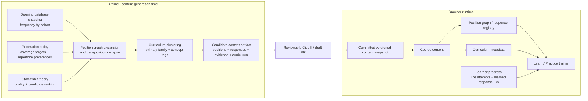
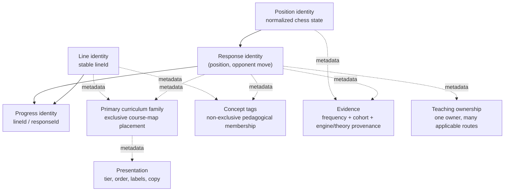
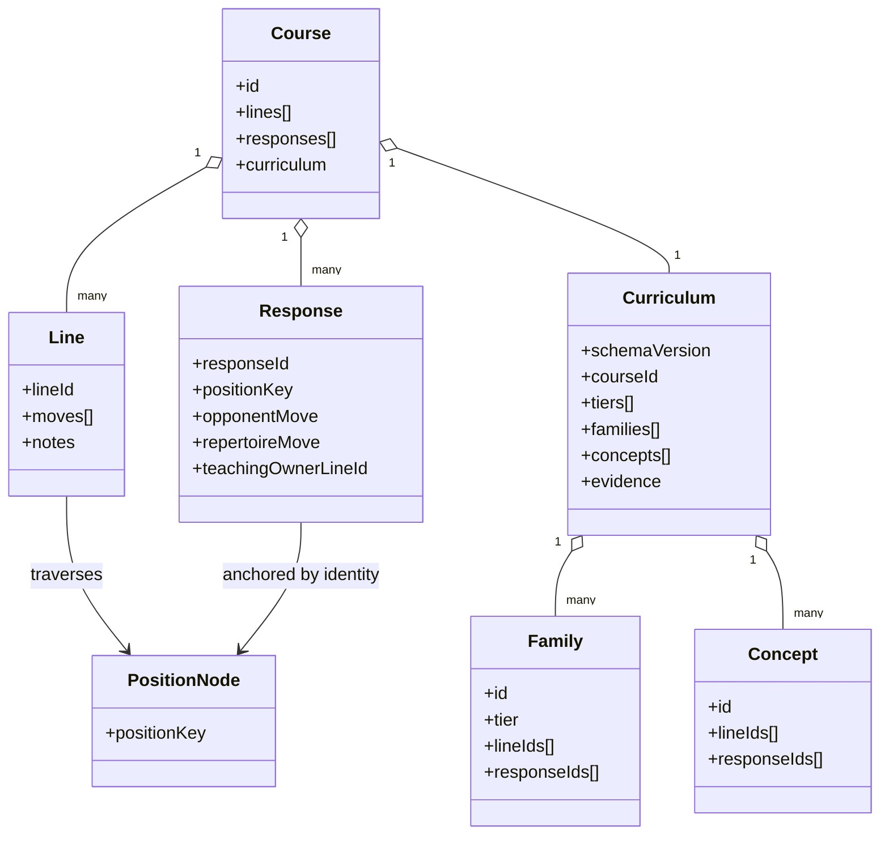
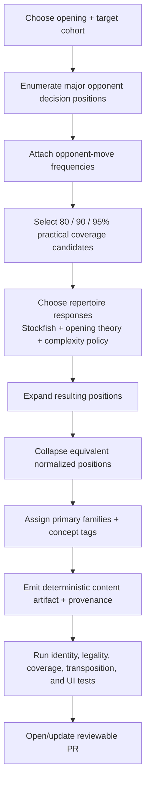
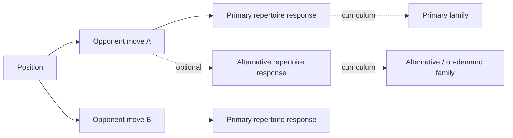
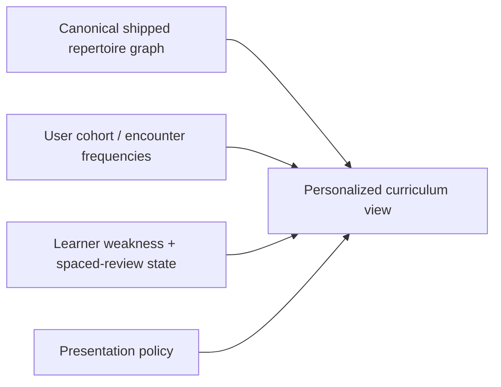
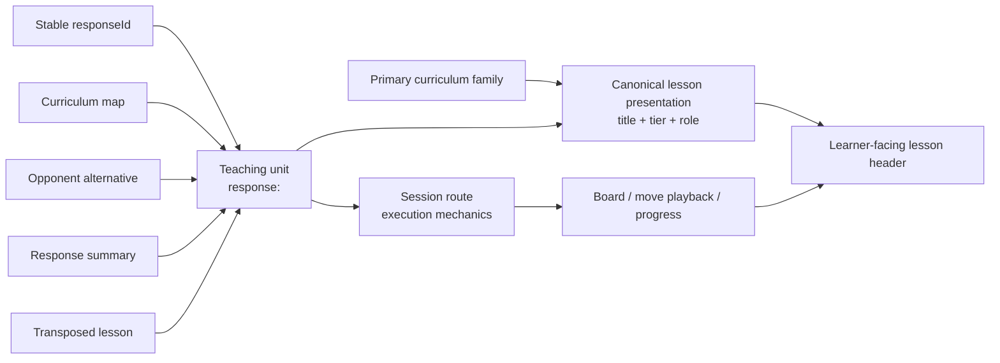

# OpenRep Architecture

This document records the intended domain boundaries and future evolution of OpenRep. `AGENTS.md` contains the standing implementation rules; this file expands the architecture diagrams those rules refer to.

## 1. Two separate systems: content generation and runtime training

OpenRep should treat repertoire discovery as an offline/content-generation concern and training as a deterministic runtime concern.

### Boundary rule

The browser runtime must not decide what repertoire ought to exist. It consumes accepted, versioned content. Opening-database queries, broad engine searches, coverage optimization, and automatic clustering belong before the Git snapshot boundary.

A routine production build should not silently regenerate curriculum from live external data. A scheduled/manual generator may refresh evidence and propose changes, but material changes should arrive as a reviewable PR.

## 2. Stable identity versus metadata

Identity must not depend on database source, engine version, curriculum tier, family, teaching owner, authoring anchor, or UI placement.

### Primary families versus concepts

A line belongs to exactly one primary curriculum family so the course map has a deterministic home for it. A response may also have at most one primary family when surfaced directly in the curriculum.

Concept tags are deliberately many-to-many. A line can simultaneously be an Exchange structure, a transposition-recognition example, and a move-order lesson. Do not overload primary families to represent every pedagogical relationship.

## 3. Runtime domain model

`PositionNode` is the conceptual long-term graph primitive. Today many runtime positions are reconstructed from authored line paths; future generated content may materialize position nodes directly. The runtime index should remain a coverage/query layer over shipped content, not become the discovery engine.

## 4. Content-generation lifecycle

A future generator should follow this lifecycle:

The generator should be deterministic for the same:
- external data snapshot;
- cohort definition;
- engine version/settings;
- generation-policy version;
- curated overrides.

Generated output should record those inputs as provenance. Do not commit an entire external opening database when a compact evidence snapshot is sufficient to explain/reproduce accepted decisions.

## 5. Repertoire choice is separate from opponent coverage

A position can have multiple objectively sound repertoire candidates even though the shipped course chooses one primary move.

Future user-selectable repertoires should introduce an explicit repertoire-choice/configuration layer rather than changing position identity or response identity.

## 6. Personalization

Personalization should normally re-rank or re-tier accepted content rather than regenerate chess identity in the browser.

Examples:
- a move can be `Important` for 1200 Blitz and `On demand` for 2200 Classical;
- weak/spaced scheduling can prioritize a specific leaf without changing its family;
- a future selected repertoire can hide alternatives while preserving stable content IDs.

## 7. Current module boundary

- `src/curriculum.js`: opening-agnostic curriculum validation, ordering, course decoration, concept lookup, and canonical teaching-unit presentation.
- `src/curriculum-trainer.js`: opening-agnostic rendering/interaction for a course that has curriculum metadata.
- `src/openings/*-curriculum.js`: opening-specific curriculum data and evidence snapshots.
- `src/repertoire-moves.js`: runtime coverage/response index over shipped content.
- future `content-generator/` (or equivalent): database adapters, engine analysis, expansion, coverage optimization, clustering, artifact emission.

When adding another opening, reuse the generic curriculum modules; do not fork Caro-Kann-specific validator/builder/trainer logic.

## 8. Teaching-unit presentation is separate from route execution

A learner can reach the same response from several entry points: the curriculum map, an opponent-alternative panel, a completed-line response list, a transposed lesson, or future search/personalization UI. Those entry points may need different navigation behavior, but they must not invent different lesson identities for the same response.

### Invariants

- `responseId` identifies the teaching unit; a route identifies how that unit is executed from a particular chess path.
- `sessionRoute.kind`, `teachingOwnerLineId`, divergence ply, and the line used to reconstruct the position are execution/authoring mechanics. They must not define the learner-facing lesson title.
- A response with a primary curriculum family resolves its title/tier/role through one opening-agnostic curriculum presentation function. Every entry path uses that same resolver.
- A family containing no full lines and exactly one response is a standalone response family. The family title is the lesson title; the course map must not create a second differently named conceptual lesson underneath it. A child action may show the concrete move pair (for example `2.c4 → d5`) without introducing another identity.
- A response inside a mixed family may use its response label as a child lesson title, while still deriving tier/family metadata through the same resolver.
- Navigation path must not change the teaching-unit presentation. Reaching `response:X` from the curriculum map and reaching `response:X` from an opponent-alternative card must produce the same lesson title and metadata.
- Regression tests should cover at least one standalone response family and assert that route-owner copy such as “from <owner line>” does not leak into the canonical lesson header.
