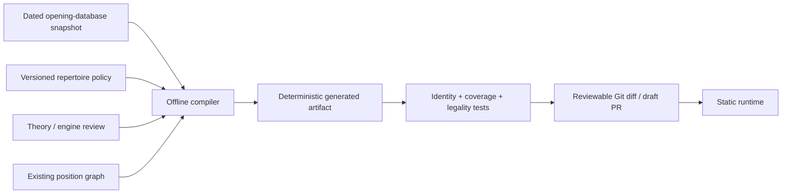

# Offline repertoire generation

OpenRep separates **repertoire discovery** from **runtime training**. Historical opening data, broad engine analysis, coverage optimization, and curriculum proposals happen here. The browser consumes only committed static content.



## Workflow

1. **Define major opponent decision points.** Use authoring anchors only to reconstruct each position. The compiler emits the normalized `positionKey`; the anchor does not become runtime identity.
2. **Capture a dated evidence snapshot.** Record the source, query date/cohort, total games, and opponent move counts. Snapshots are immutable historical inputs: create a new dated file when refreshing data.
3. **Compute 80 / 90 / 95 checkpoints.** Moves are sorted deterministically by observed game count. The compiler records the smallest move set that reaches each checkpoint.
4. **Choose repertoire responses.** Historical frequency determines *what the opponent is likely to play*, not Black's response. Response selection remains a policy decision informed by opening theory, engine analysis, consistency, and pedagogical complexity.
5. **Emit stable content.** New one-decision material becomes a normal `Response` keyed by canonical `(position, opponent move)` identity. Multi-decision teaching should be promoted to a full `Line` rather than stretching a response into a hidden branch.
6. **Project curriculum metadata.** Moves required to reach the 80% checkpoint are Core; additional accepted material through the 95% checkpoint is Important. Observed material beyond 95% is Sideline unless a deliberate pedagogical override says otherwise. The 90% checkpoint remains visible evidence even though it is not a separate UI tier.
7. **Review through Git.** Generated output must be committed and reviewed. Production builds do not query opening databases or silently regenerate curriculum.

## Caro-Kann

The current source inputs are:

- `openings/caro-kann/2026-08-21.snapshot.mjs` — dated master-game frequency evidence and reviewed terminal-alternative evidence.
- `openings/caro-kann/coverage-policy.mjs` — versioned response choices and teaching content layered onto the evidence.
- `generate-caro-kann.mjs` — resolves canonical positions from the course graph and emits `src/openings/generated/caro-kann.generated.js`.

Generate and verify with:

```sh
npm run repertoire:generate
npm run repertoire:check
```

`npm run check` includes the stale-artifact check, so changing a snapshot, policy, anchor, or compiler without committing the regenerated artifact fails CI.

## Refreshing historical data

Do not edit an old snapshot to represent newer database state. Add a new `YYYY-MM-DD.snapshot.mjs`, update the generator import in the same PR, regenerate, and inspect the diff in four categories:

- opponent moves newly entering or leaving 80/90/95 coverage;
- newly required responses or lines;
- curriculum tier changes;
- accepted repertoire alternatives whose engine/theory evidence changed.

The source adapter can later be automated against Lichess, Chess.com, 365Chess, or another database. That automation should produce the same snapshot schema; runtime modules and stable response IDs should not need to change.
