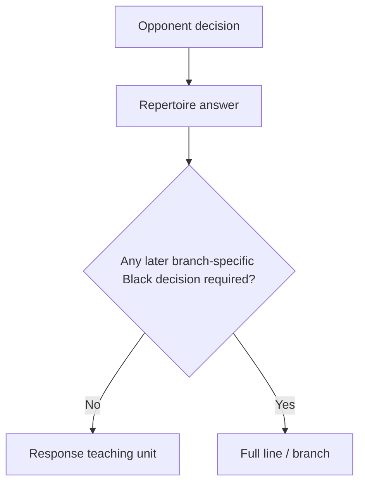

# Teaching horizon and line termination

OpenRep should not end repertoire lines at a fixed move number. A line is a teaching unit, so its horizon is determined by how long the branch continues to require concrete, branch-specific repertoire decisions.

This policy applies to curated content today and should become an input to future offline database/engine generation. It is generation and curriculum policy, not chess-position identity.

## Response versus full line

A `Response` teaches exactly one opponent decision and one repertoire answer. Its optional continuation may illustrate what the answer leads to, but it must not create additional required repertoire-side decisions.

Promote material to a full `Line` when understanding the branch requires the learner to make one or more later repertoire-side decisions after the initial answer. Full-line coverage then takes precedence over a standalone response for the same canonical opponent move.

## When a full line should end

Continue the line while the next Black decision is both:

1. **branch-specific** — the correct plan depends materially on the variation just entered; and
2. **high-information** — choosing the wrong plan is likely to lose material/evaluation, concede the opponent's main compensation, miss a critical transposition, or teach a materially different structure.

End at the earliest position where the branch's teaching objective is resolved and at least one of these conditions is true:

- **Transposition reached:** the position is already covered by another canonical teaching unit, so continuing would duplicate known material.
- **Forcing episode resolved:** the tactical/gambit/move-order problem that made the branch distinct has been neutralized.
- **Stable structure reached:** the learner has reached the intended pawn structure and the next moves are mostly normal development or plan execution already taught elsewhere.
- **Marginal novelty is low:** extending farther would mostly add generic moves rather than another recognition cue or repertoire decision worth recalling independently.

There is intentionally no fixed target such as “ten moves.” Short forcing sidelines may end quickly; a strategically dense line may run longer. The useful unit is the number of meaningful repertoire decisions, not the PGN move number.

## Future generator policy

A future offline generator should choose the horizon using evidence such as:

- opponent move frequency at subsequent decision nodes;
- engine/theory criticality of the next Black choice;
- whether a position transposes into already accepted coverage;
- branching entropy: whether several materially different opponent continuations remain;
- pedagogical novelty: new pawn structure, tactical motif, recognition cue, or plan;
- complexity cost of adding another decision versus the practical coverage gained.

The generator may emit horizon/provenance metadata explaining why it stopped, but that metadata must remain separate from `lineId`, normalized position identity, and canonical response identity.

## Current example: Classical 5.Bd3 Burris Gambit

The previous Caro-Kann content modeled `5.Bd3` as one response. That was too narrow because the branch contains several later Black decisions that are part of the same teaching objective: accept the gambit pawn, survive the development tempo on the queen, reduce White's compensation, and consolidate.

The full teaching line now runs through:

`5.Bd3 Qxd4 6.Nf3 Qd8 7.Qe2 e6 8.O-O Bxe4 9.Bxe4 Nf6 10.Bf4 Nbd7 11.Rfd1 Qb6`

The line stops after `Qb6` because the gambit-specific problem is resolved: Black has kept the extra pawn, stepped out of the d-file pressure, reduced White's initial compensation through exchanges, and can now finish with ordinary development such as Be7 and castling. Continuing farther would add substantially less branch-specific information.
